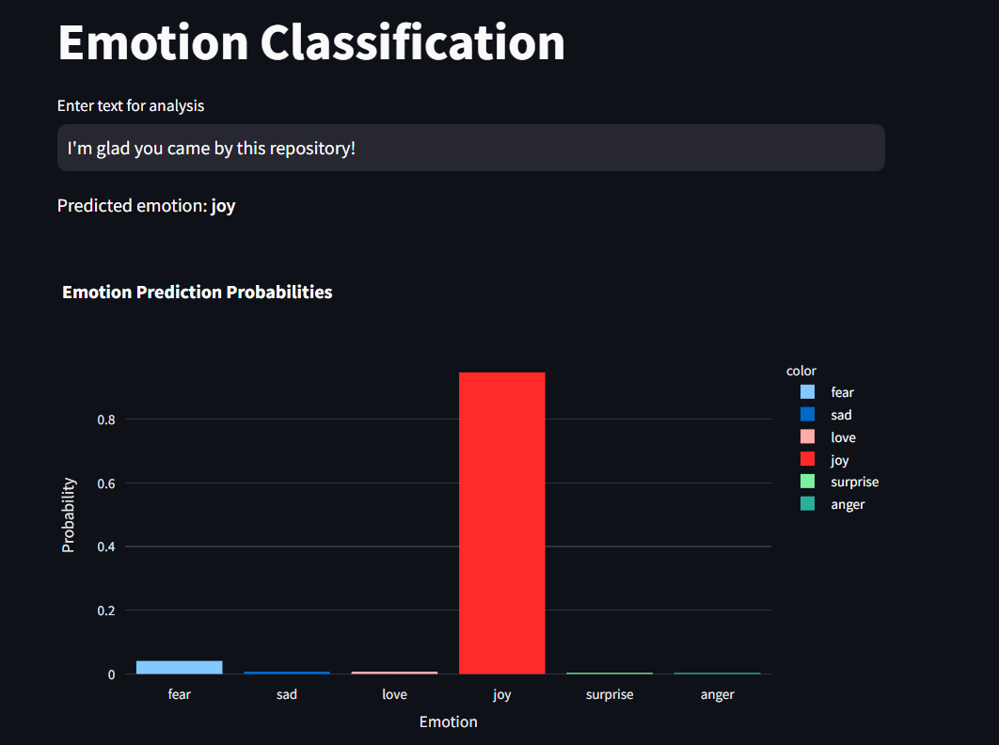
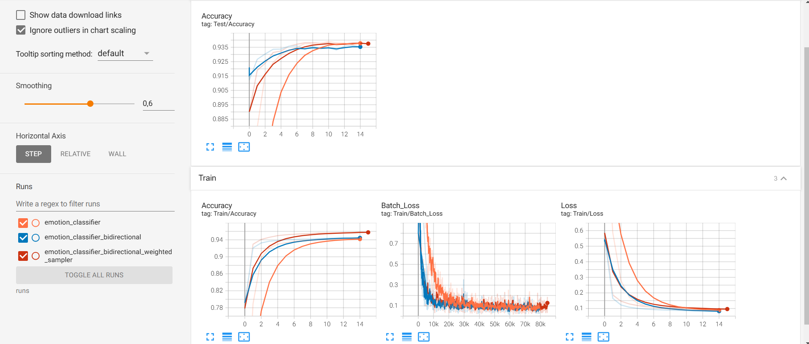

# Emotion Classification



This repository contains code for **Emotion classification** model.

# Data
[Sentiment and Emotion Analysis Dataset](https://www.kaggle.com/datasets/kushagra3204/sentiment-and-emotion-analysis-dataset) was used to train this model

# Results


This model has **0.9580 train accuracy** and **0.9371 test accuracy**

# How to run

Create a conda environment:
```
conda env create -f environment.yaml
```

Or install all dependencies with *pip*:
```
pip install -r requirements.txt
```

To train model run ``python train.py``

You can run **Tensorboard** by typing

```
tensorboard --logdir runs
```

And you can use Web-interface, created with **Streamlit**:
```
streamlit run ui.py
```